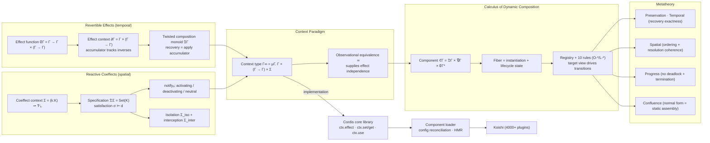
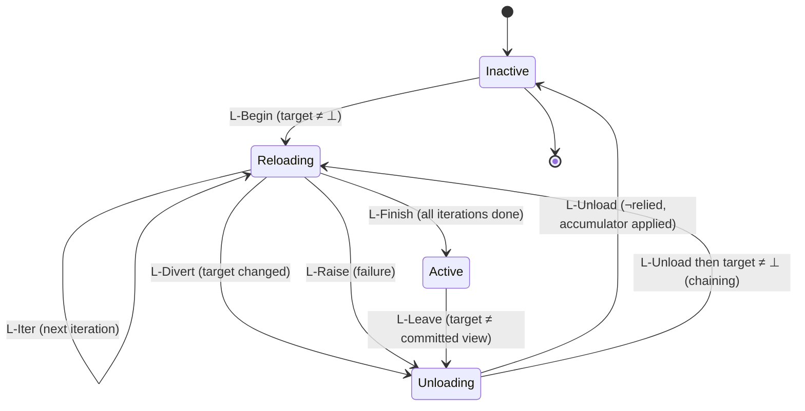

# A Programming Paradigm for Spatiotemporal Composability

> [!tldr] The Cordis paper (Shi, Zhang & Cui, draft 2026-08-13) gives dynamic composition its first full formal foundation. It lifts classical effects and coeffects to runtime mechanisms — **revertible effects** (every context transformation carries an inverse the runtime tracks) and **reactive coeffects** (context changes notify components against their declared dependencies) — unifies both in a single recursive context type, and proves a calculus of dynamic composition whose metatheory carries recovery and dependency guarantees from one component to a whole interleaved system. The model is implemented as **Cordis**, a meta-framework validated by **Koishi**, a chatbot framework with 4000+ community plugins.

## Problem & Motivation

Composition — assembling complex systems from simpler parts — is foundational to software engineering, but it has traditionally been *static*: function calls, module imports, and class inheritance are resolved at compile time. Modern software increasingly demands **[[concepts/dynamic-composition|dynamic composition]]**, where components are loaded, unloaded, and reconfigured at runtime:

- **Plugin systems** — Visual Studio Code's extension host runs all extensions in one process; 87 of the top 100 extensions by install count contain executable code, yet there is no way to unload an individual extension without restarting the host. `extensionDependencies` exists but only 7 of the top 100 extensions declare dependencies on non-built-in extensions. The spatial surface is similarly weak: `vscode.extensions.getExtension(...).exports` is untyped, so there is no checked interface between extensions. ^[extracted]
- **[[concepts/self-evolving-agent-harnesses|Self-evolving agent harnesses]]** — a future harness may generate and deploy modifications to its own components while continuously serving requests. Without temporal composability, every self-modification forces a full restart that discards process-local state; a faulty self-modification can even disable the very process needed to recover. Without spatial composability, each module detects dependency changes by ad hoc means. ^[extracted]

The coarse-grained workaround (OS processes for temporal, container orchestrators for spatial) discards all process-local state on restart and cannot express dependencies between components sharing an address space. The paper's thesis: the missing abstraction is a compositional system that manages effects and dependencies at the same granularity as the components themselves. ^[extracted]

The paper observes that **effects** (how a computation modifies its environment) and **coeffects** (how a computation depends on its environment) already formalize exactly these two dimensions — but only as *static*, compile-time instruments over lexically fixed scopes. The paper's move is to **reify them as runtime mechanisms**: rather than annotating types, the runtime operates on effects and coeffects directly. ^[extracted]

## Method / Architecture

The paper's architecture proceeds bottom-up: revertible effects give local temporal composability; reactive coeffects give local spatial composability; an observational equivalence on coeffects supplies effect independence; and a single recursive context type unifies both into a programming paradigm. A calculus of dynamic composition then carries the two guarantees from one component to a whole system, and the metatheory establishes preservation, global composability, progress, and confluence.

*Architecture of the Cordis paradigm (reconstructed from the paper's prose; figures are vector/text and could not be raster-extracted, so this Mermaid diagram stands in for Figure 1/Figure 2).* ^[inferred]

### Revertible effects (Section 3.1)

An effect is modeled as a function of type Γ → Γ × (Γ → Γ): applied to the current context it yields the modified context together with an explicit inverse. The runtime tracks these inverses on the **effect context** ∂Γ = Γ × (Γ → Γ), where the second component is the *accumulator* — the composite of inverses performed so far. Recovery applies the accumulator; the soundness invariant is φ(γ) = γ₀. ^[extracted]

**Independence** (Definition 19) is the key structural property: two effect functions are independent when their transformations commute and neither disturbs the inverse the other yields. Under pairwise independence, the inverses of a sequence can be applied in *any* permutation (Corollary 21) — which is what allows interleaved components to be withdrawn out of the accumulator's LIFO order. ^[extracted]

### Reactive coeffects (Section 3.2)

The coeffect context is a dependent partial function type Σ = (k : K) ⇀ 𝒱ₖ — a typed dependency table. A component declares a **coeffect specification** 𝔇Σ = Set(K); satisfaction is σ ⊨ d = ∀k∈d. k∈dom(σ). Every context change is classified by a specification as **activating** (σ ⊭ d ∧ σ′ ⊨ d), **deactivating** (σ ⊨ d ∧ σ′ ⊭ d), or **neutral**. Since all table mutations flow through revertible effect functions, every satisfaction change is observed at an effect boundary — "the algebraic basis of reactivity." ^[extracted]

Two extensions make this practical: **isolation** (Σ_iso = (K ⇀ R) × ((r:R) ⇀ 𝒱_r), a realm table that lets the same key resolve to different values in different contexts — runtime ad-hoc polymorphism) and **interception** (Σ_inter carries metadata merged into each dependency access, enabling cross-cutting behavior without modifying the dependency value). ^[extracted]

### The context paradigm (Section 3.3)

The effect context and coeffect context unify into a single recursive type:

$$ \Gamma_\infty \;\coloneqq\; \mu\Gamma.\; \Gamma \times (\Gamma \to \Gamma) \times \Sigma $$

with projections for current state, the accumulator that recovers this level's effects, and the coeffect context carrying dependencies. Because the type family 𝒱 is unconstrained, *any* shared state can be encoded as a dependency — Σ subsumes all shared mutable state, not just inter-component dependencies. Loading a component = executing its effects ("plugging in"); unloading = recovering them ("unplugging"). ^[extracted]

**Observational equivalence** ≃ (Section 3.3.2) reads recovery equality up to observable behavior rather than physical representation: heap layouts and generative names need not be literally restored, only observably so. Assembling ≃ from the coeffects' own equivalences and quotienting by it is what supplies the effect *independence* that Section 3.1.3 requires — commuting can hold up to ≃ even when it fails on the nose. ^[extracted]

### Calculus of dynamic composition (Section 4)

A **component** pairs a coeffect specification (d), a provision (p — keys it may provide), and a witnessed effect function (e): ℭΓ = 𝔇Γ × 𝔓Γ × 𝔈Γ*. A **fiber** is an instantiation of a component carrying a lifecycle state. The registry maps fiber names to fibers; the coeffect context is *derived* as the union of the tables of ACTIVE fibers, so each key has exactly one possible provider (disjoint provisions enforced by O-Insert). ^[extracted]

The **base calculus** has five rules: three orchestration rules (O-Insert, O-Retire, O-Remove) and two lifecycle rules (L-Reload, L-Unload). The lifecycle is driven by comparing a fiber's **committed view** (the resolution it activated against) with its **target view** (the resolution it *should* be running against). Section 4.3 refines this to handle real control flow — withdrawal ordering (L-Leave/L-Unload with a `relied` guard), iteration (L-Begin/L-Iter/L-Finish/L-Divert), asynchrony (inertia: an in-flight iteration lands before the fiber deactivates), and failure (L-Raise, per-fiber error outcomes). ^[extracted]

*Component lifecycle with transitions in progress (reconstructed from Figure 2: Inactive, Reloading, Active, Unloading).* ^[inferred]

### Implementation: Cordis (Section 5)

Cordis is a **meta-framework** — it prescribes no concrete scenario, only universal dynamic-composition semantics — implemented in TypeScript in three tiers:

1. **Core library**: every context mutation flows through a single primitive `ctx.effect` (realizing effect_Γ). `ctx.set`/`ctx.get` realize coeffect provision (as effect functions — so dependency registrations inherit revertibility). A `Proxy`-mediated context (`ctx[key]`) resolves against the accessing fiber's committed view, enforcing the coeffect specification at the point of use (Algorithm 6). `ctx.use` instantiates a component as a fiber; `refresh`/`reload`/`unload` realize the inertial state machine. ^[extracted]
2. **Component loader**: a declarative configuration layer (entries with id/url/isolate/intercept/config/disabled) with incremental reconciliation — sound because the metatheory guarantees the quiescent state is a function of the final configuration (Theorem 73), the system always quiesces (Theorem 66), a departing fiber leaves nothing behind (Corollary 62), and load order need not be arranged (Theorem 63). Plus **hot module replacement** via the `@cordisjs/hmr` component: classify → detect stale entries → transactional reload with cache rollback. ^[extracted]
3. **Koishi**: an open-source chatbot framework built on Cordis — 4000+ community-contributed plugins over four years; the web console is a second, independent Cordis application. ^[extracted]

## Key Equations

The effect context (Def 2) — the state the runtime tracks:

$$ \partial\Gamma \;\coloneqq\; \Gamma \times (\Gamma \to \Gamma) $$

Twisted composition of effect pairs (Def 1) — inverses accumulate in reverse order:

$$ (f_1, g_1) \circ (f_2, g_2) \;\coloneqq\; (f_1 \circ f_2,\; g_2 \circ g_1) $$

The unified context type (Def 32):

$$ \Gamma_\infty \;\coloneqq\; \mu\Gamma.\; \Gamma \times (\Gamma \to \Gamma) \times \Sigma $$

Recovery exactness (Theorem 61) — applying a fiber's accumulator at state u yields, up to control fields, the state the same steps would have produced had the fiber never begun:

$$ g_n^u(\gamma^u) \;\approx\; (\Psi_{t_l} \circ \cdots \circ \Psi_{t_1})(\gamma^b) $$

The paper also states the twisted-composition monoid laws (Theorem 5: `track` is a monoid homomorphism), the witness condition of effect functions (Def 8: g(δ) = γ where (δ,g) = e(γ)), the reactive classification of `notify_d` (Def 26), and the support/confluence machinery (Defs 67–69, Theorem 73).

## Results

This is a theory paper with an implementation case study rather than a benchmark suite; the "headline numbers" are the metatheory guarantees and the Koishi adoption evidence:

### Metatheory results (Section 4.4)

| Theorem | Guarantee | Key hypothesis |
|---|---|---|
| Thm 59 Preservation | Well-formedness of the registry is preserved by every rule | — |
| Thm 61 + Cor 62 Recovery exactness (global temporal composability) | Running a fiber's accumulator withdraws its contribution and nothing else, however interleaved | pairwise-independent effect iterators |
| Thm 63 Ordering (global spatial composability) | Dependencies activate after providers; providers withdraw only after dependents deactivate | `relied` guard on L-Unload |
| Thm 64 Resolution coherence | No single transition straddles two resolutions of its coeffects | inertia + L-Iter/L-Finish target check |
| Thm 66 Progress | No deadlock + termination: S(n) ≤ (K+4)(V(n)+1) | ≺ acyclic, bounded iteration |
| Thm 73 Confluence | Every sequence quiesces at the state a static assembly would have produced | pairwise independence + totality on provision |

### Koishi case study (Section 5.3)

| Claim | Value |
|---|---|
| Community plugins over 4 years | 4000+ |
| Validation | Existence-and-adoption result (not a controlled comparison) |
| Threat to validity | Single ecosystem, single host language (TypeScript), observational |

### Motivation data (Section 1.2, VSCode Marketplace survey June 9 2026)

| Measure | Value |
|---|---|
| Top-100 extensions containing executable code | 87 |
| Top-100 extensions declaring `extensionDependencies` on non-built-ins | 7 |

## Limitations

- **Recovery is up to ≃, not on the nose.** Physical state cannot always be restored (heap layouts, generative names); the guarantee is observational equivalence, and only for state bound at a coeffect key. Un-bound state lies outside the guarantee. ^[extracted]
- **The witness is an obligation, not a check.** The runtime does not verify that a supplied inverse actually recovers the effect; the component author must supply sound inverses (Section 6.1 delimits the obligation). ^[extracted]
- **Emissions crossing the system boundary are not recovered.** Data pushed outside the boundary acts as id_Γ; recovery beyond it requires withholding (output commit) or compensation (sagas), and the metatheory's commutation is proved against ≃, not the coarser compensation equivalence. ^[extracted]
- **Independence is assumed then discharged.** Pairwise independence is a hypothesis on components; Section 3.3.2 discharges it via commutative coeffect keys, but a non-commutative key (e.g. an ordered middleware chain) keeps its order constraints. ^[extracted]
- **Dependency typing is nominal.** Key identity alone establishes links; interface drift and key collision between independently built components are unsolved (Section 6.6 discusses namespacing, peer dependencies, and structural compatibility as open approaches). ^[extracted]
- **In-memory state does not survive a reload.** Unlike DSU/HMR forward migration, Cordis reverts the old component and reapplies from a clean slate; layering DSU-style migration atop revertible effects is future work. ^[extracted]
- **No quantitative evaluation.** The case study is observational; measuring abstraction overhead and productivity impact against a baseline is future work. ^[extracted]
- **Agent self-evolution is a future direction, not a result.** The paper motivates self-evolving agent harnesses and proposes them as the compelling validation direction, but does not yet evaluate them. ^[extracted]

## Related

- [[concepts/dynamic-composition]] — the umbrella problem the paradigm addresses
- [[concepts/temporal-composability]] / [[concepts/revertible-effects]] — the time dimension
- [[concepts/spatial-composability]] / [[concepts/reactive-coeffects]] — the space dimension
- [[concepts/context-paradigm]] — the unified programming paradigm
- [[concepts/self-evolving-agent-harnesses]] — motivating application + future validation
- [[concepts/ai-harness]] — agent harness engineering context in this wiki
- [[concepts/functional-programming]] — the explicit-state-threading pole the context paradigm contrasts with
- [[entities/cordis]] — the meta-framework implementation
- [[entities/koishi]] — the 4000+-plugin production case study
- [[entities/cordiverse]] — the organization behind the repo
- [[entities/yifan-shi]], [[entities/wei-zhang]], [[entities/tianyi-cui]] — authors
- [[entities/peking-university]] / [[entities/deepseek|DeepSeek-AI]] — author affiliations
- [[misc/web-github-com-cordiverse-paper|Cordis paper repository]] — repo landing page

## Sources

- <https://github.com/cordiverse/paper> — repository (draft of August 13, 2026)
- <https://raw.githubusercontent.com/cordiverse/paper/main/paper.pdf> — the 88-page PDF
- Local source: `/home/harshal/dotfyles/Obsidian-Vault/research/cordiverse-paper/paper.pdf`
