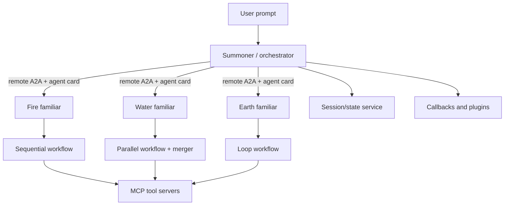

# Google Hands-on AI Multi-Agent Lab — MCP, ADK, A2A, and Agent Memory

> [!tldr] The captured video turns a multi-agent design into a deployable lab: expose tools through MCP, compose deterministic ADK workflow agents, expose them through A2A, apply lifecycle policy with callbacks/plugins, and carry state across delegation.

## Source and Capture

The embedded media in [Codila's X post](https://x.com/i/status/2083602508807569560) measures **02:03:00.138**. Its source stream is H.264 video with stereo AAC audio at 44.1 kHz. The audio was normalized to 16 kHz mono signed-16-bit PCM and transcribed through BharatCode's remote Whisper Large V3 Turbo service in 123 one-minute windows. The API returned text-only payloads, so timestamps below are approximate window boundaries; they are not word-level timing. The final 138 ms was measured as near-silence and omitted. ^[extracted]

The recording is a two-part “Hands-on AI” lab. Part one builds MCP servers and local workflow agents; part two deploys remote A2A agents, adds lifecycle controls, persists state, and runs a dungeon-style boss fight. ^[extracted]

## Timeline

| Approximate time | Lab section | Distilled content |
|---|---|---|
| `00:00–00:10` | Setup and architecture | The presenters introduce a layered system: tools, domain/workflow agents, an orchestrator, and state/memory. Cloud Shell, project setup, APIs, Artifact Registry, Cloud Build, and Cloud Run are prepared. |
| `00:11–00:36` | MCP servers | The lab builds an external-API MCP server, a general-function MCP server for deterministic calculations, and an MCP database toolbox connected to Cloud SQL. A test agent discovers tools and calls them. |
| `00:37–00:55` | ADK workflow agents | Sequential, parallel, and loop agents are composed from specialist workers. A sequential “scout then amplify” path, a parallel water path with a merger, and a charging loop are tested in ADK Run/Web. |
| `00:56–01:12` | A2A deployment | Fire, water, and earth familiar agents are converted to A2A endpoints and deployed as separate Cloud Run services. The distinction is explicit: MCP is for tools; A2A is for agents. |
| `01:13–01:26` | Remote orchestration | A summoner/orchestrator consumes remote A2A agents through their agent-card well-known URLs. The lab demonstrates routing by task and inspects an agent card containing name, description, capabilities, and supported workflow details. |
| `01:26–01:44` | Callbacks and plugins | Agent lifecycle callbacks inject custom logic before/after agent, model, and tool execution. A cooldown callback rejects rapid repeat calls; the same policy is moved into a runner plugin so all remote familiar agents receive it. |
| `01:45–01:54` | State versus memory | State is presented as concrete key/value scratch data passed between agents and tools; memory is broader conversational or long-term context. An after-tool callback stores the last summoned familiar in agent state. |
| `01:55–02:03` | Deployment and boss fight | The summoner is deployed, connected to a dungeon agent over A2A, and tested with question-and-answer combat. The recap returns to MCP, workflow agents, A2A, callbacks/plugins, and state/memory. |

## Architecture Distilled

The lab's topology is a concrete instance of the layered agent stack: MCP servers expose external capabilities; workflow agents encode predictable local control flow; A2A makes separately deployed agents discoverable; an orchestrator chooses among them; runner services apply shared lifecycle policy; state services carry execution data. ^[inferred]

## MCP Tool Layer

The lab demonstrates three ways to expose capabilities:

- **External API MCP server:** Python functions wrap API endpoints and are exposed through MCP `list tools` and `call tools` operations.
- **General-function MCP server:** a deterministic calculation function is made available as a tool so the model does not have to perform arithmetic itself.
- **Database toolbox:** a YAML configuration describes Cloud SQL connection details and tool queries, avoiding a custom server for each database operation.

The transcript presents MCP as a universal adapter for agents and tools. It separately describes A2A as the protocol for agent delegation and remote agent discovery. ^[extracted]

## Workflow Agents

The ADK workflow patterns are deliberately deterministic:

- **Sequential:** fixed order, such as selecting an ability and then amplifying its damage.
- **Parallel:** independent specialists run together, followed by a merger that synthesizes their outputs.
- **Loop:** a charging agent repeats until a condition is met; the presenters compare it to a programming `for` loop and to producer–critic refinement.

The lab also notes that these patterns compose: a parallel block can live inside a sequence, or a sequence can run inside a loop. ^[extracted]

## A2A Agent Cards and Deployment

Each familiar agent is exposed as a remote service. The A2A wrapper publishes an agent card at a well-known path; the card describes what the agent can do and how a client can contact it. The summoner uses remote A2A agent definitions with the deployed URL and agent-card path rather than importing the familiar's implementation into the same process. ^[extracted]

This produces a useful boundary:

| Concern | Protocol or runtime role |
|---|---|
| Discover and call tools | MCP server / MCP tool set |
| Discover and delegate to agents | A2A endpoint / agent card |
| Compose predictable local control flow | ADK sequential, parallel, and loop agents |
| Apply shared lifecycle policy | ADK runner plugins |
| Carry execution data | Session/state services |

The presenters explicitly say A2A can connect agents built with different technologies and deployed locally, on-premises, Cloud Run, GKE, or other clouds, provided they comply with the protocol. This is a claim made in the lab, not an interoperability test performed here. ^[ambiguous]

## Callbacks, Plugins, and Throttling

A callback is a hook at a defined point in the agent lifecycle. The lab names before-agent, before-model, after-model, before-tool, after-tool, and after-agent positions. Callbacks can manage state, enforce controls, or apply security checks.

The example callback checks the last invocation time and rejects a call inside a 60-second cooldown. The same logic is then implemented as a runner plugin, which applies the policy to every agent handled by that runtime rather than copying a callback into each agent definition. ^[extracted]

This is a narrow but useful graph invariant: fan-out does not mean policy fan-out. Shared runner policy can preserve the same guard across remote nodes. ^[inferred]

## State Versus Memory

The lab distinguishes two related forms of persistence:

- **State:** concrete execution values, represented as key/value data and passed between agents or tools. The example saves `last_summon` after a tool call.
- **Memory:** the broader conversational or long-term context that can survive beyond a single interaction, potentially stored in a database or managed memory service.

The distinction is operational rather than absolute: state is a local scratchpad for the current workflow, while memory is the larger system for retaining and retrieving context across interactions. ^[inferred]

## Graph Engineering Lessons

The linked article supplies the graph-level rules that the lab's implementation makes concrete:

1. Draw edges only where data really crosses a boundary.
2. Use parallel workflow nodes where work is independent.
3. Keep verification on a fresh context or an external test signal.
4. Isolate workers before scaling fan-out.
5. Keep state and policy outside the model's prose where possible.
6. Use a line when the task is genuinely sequential or too small to justify coordination. ^[inferred]

The lab's orchestrator, remote familiar agents, workflow subgraphs, MCP tool servers, runner plugins, and state service can therefore be read as a graph of graphs rather than a single autonomous agent. ^[inferred]

## Caveats

- The remote transcript is approximate and contains recognition errors; the timeline is a distillation, not a verbatim transcript.
- The X post's “Graph engineering” label is broader than the captured lecture's concrete emphasis on MCP, ADK, A2A, and agent runtime mechanics. ^[ambiguous]
- Cloud service setup, credentials, billing credits, and deployment behavior are lab-specific and should not be treated as production recommendations without independent review.
- The article's agent-count, throughput, and cost figures are reported claims. ^[ambiguous]

## Related

- [[misc/web-x-com-i-status-2083602508807569560|Graph Engineering X Source]] — post, linked article, and media provenance
- [[concepts/agent-architecture|Agent Architecture]] — layered client, reasoning, workflow, and tool model
- [[concepts/model-context-protocol|Model Context Protocol]] — tool discovery and invocation
- [[concepts/agent-to-agent-communication|Agent-to-Agent Communication]] — agent delegation boundary
- [[concepts/agent-workflows|Agent Workflows]] — deterministic orchestration patterns
- [[concepts/agent-loop|Agent Loop]] — the single-loop primitive
- [[concepts/agent-memory|Agent Memory]] — state and memory distinction
- [[entities/google-agent-development-kit|Google Agent Development Kit]] — framework used in the lab
