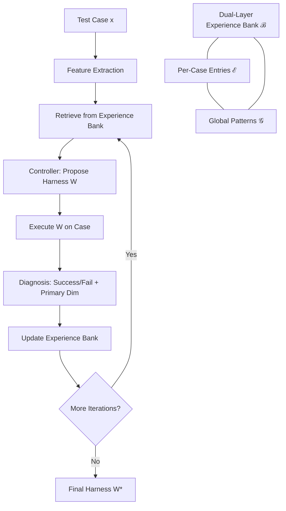

# MemoHarness: Agent Harnesses That Learn from Experience

> [!tldr] MemoHarness (arXiv:2607.14159v1, Jul 2026) decomposes the agent harness into six editable control surfaces and introduces a dual-layer experience bank — per-case entries plus distilled global patterns — to accumulate execution experience. At test time, the harness adapts to each case via retrieval from that bank without labels, feedback, or additional search. Outperforms Codex by +0.084 on Terminal-Bench and transfers across models (+0.098 mean) and datasets. Preprint, under review — stated limitations include no confidence intervals, point estimates, and caching-dependent cost profile.

## Problem & Motivation

Agent performance depends on the entire **agent harness** — the external control layer specifying context construction, tools, decoding, orchestration, memory, and output handling. Existing automated improvement methods optimize narrower artifacts:

- **Prompts** (OPRO, Promptbreeder) — edit prompt text only
- **Declarative pipelines** ([[entities/dspy|DSPy]]) — optimize module compositions
- **Agent workflows** (AFlow) — search workflow topologies

None jointly edit the full control layer, and deployed agents typically reuse a single global harness for all cases despite large variation in domain, reasoning depth, retrieval needs, and output format. ^[extracted]

**MemoHarness's thesis:** Execution experience from past runs can be accumulated and reused to adapt the harness to each test case *without test-time labels, feedback, or additional search*. ^[extracted]

## Method / Architecture

### Six-Dimensional Harness Space

MemoHarness decomposes the harness into six independent control surfaces $\mathcal{W} = \prod_{d=1}^{6} \mathcal{W}^{(d)}$: ^[extracted]

| Dim | Stage | Controls |
|-----|-------|----------|
| D1 | Context assembly | Pre-call input construction: prompt structure, demos, compression |
| D2 | Tool interaction | External tool/retrieval: enable retrieval, set top-k, rerank evidence |
| D3 | Generation control | Decoding: max tokens, temperature, sample candidates |
| D4 | Orchestration | Workflow topology: single call → plan/execute/refine |
| D5 | Memory management | Cross-call state persistence: keep, summarize, drop stale context |
| D6 | Output processing | Post-call: extract answer, validate schema, choose fallback |

### Dual-Layer Experience Bank

The framework maintains $\mathcal{B}_t = (\mathcal{E}_t, \mathcal{G}_t)$ where: ^[extracted]

- **Per-case entries** $\mathcal{E}_t$ store (case id, iteration, features, harness $W_t$, config delta $\Delta_i^{(t)}$, trajectory $\tau_i$, reward $r_i$, cost $c_i$, diagnosis $z_i$)
- **Global patterns** $\mathcal{G}_t$ are distilled every $N$ iterations from failure clusters across cases
- The **diagnosis operator** produces $z_i^{(t)} = (s_i^{(t)}, d_{i,\text{prim}}^{(t)} \in \{1..6\} \cup \{\varnothing\}, \mathcal{D}_{i,\text{sec}}^{(t)}, a_i^{(t)})$ — detecting which dimension caused failure

### Training-Time Search (Phase A)

1. Start from minimal harness $W_0$ (no demos, no tools, single-call, no memory, raw output)
2. Each iteration: controller builds query → retrieves bounded evidence slice → proposes $W_t$
3. $W_t$ executed on all search cases; trajectories, rewards, costs recorded; diagnoses written to bank
4. Final selection: lexicographic argmax over $(\bar{r}_t, -\bar{c}_t)$ — correctness first, cost as tiebreaker

### Test-Time Case Adaptation (Phase B)

For test case $x = (u, \phi)$: retrieve top-$K$ similar historical entries by cosine similarity $\rho_\psi(x, \xi) = \cos(\psi(u), \psi(u_\xi))$, combine with global patterns, and the controller emits $W(x) = \Pi_{\text{test}}(W^\star, x, \mathcal{S}_{\text{test}}(x))$ — one-shot, no feedback loop. ^[extracted]

### Core Equations

$$
W \in \mathcal{W} = \mathcal{W}^{(1)} \times \cdots \times \mathcal{W}^{(6)}
$$

*Six-dimensional harness configuration space.*

$$
W^\star \in \operatorname{argmax}_{\text{lex},\, W_t \in \mathcal{C}_{\text{feas}}} (\bar{r}_t, -\bar{c}_t)
$$

*Lexicographic selection: maximize reward, minimize cost.*

| # | Equation | Description |
|---|----------|-------------|
| 1 | $\mathcal{D}_{\text{search}} = \{ x_i^s = (u_i, \phi_i, y_i^\star) \}_{i=1}^n$ | Search set: instruction, features, reference output |
| 3 | $\tau_i(W) = (y_i(W), \mathcal{M}_i(W), \kappa_i(W))$ | Execution trajectory: prediction, tool-IO trace, diagnostics |
| 4 | $c_i(W) = n_i^{\text{tok}}(W)$ | Search-time cost = total token usage |
| 5 | $\rho_\psi(x, \xi) = \cos(\psi(u), \psi(u_\xi))$ | Test-time similarity via instruction embedding cosine |

## Results

### RQ1 — Terminal-Bench Comparison

| Baseline | Score |
|----------|-------|
| **MemoHarness** | **0.806** |
| Codex | 0.722 (+0.084) |
| Other baselines (OpenCode, Terminus, Claude Code) | +0.250 to +0.445 behind |

### RQ2 — Search Progress (Base → Final)

| Benchmark | Base | Final | In-training peak |
|-----------|------|-------|-----------------|
| Terminal-Bench | 0.722 | 0.806 | 0.833 |
| LiveCodeBench | 0.900 | 0.967 | 1.000 |
| FinanceAgent | 0.600 | 0.767 | 65.0% |

### RQ3 — Cross-Dataset Transfer (Terminal-Bench Source)

| Benchmark | Before | After | Delta |
|-----------|--------|-------|-------|
| MMMLU | 0.818 | 0.848 | +0.030 |
| StrongReject | 0.879 | 0.909 | +0.030 |
| SWE-Bench Pro | 0.706 | 0.765 | +0.059 |
| HumanEvalFix / Reasoning-Gym / LawBench | — | — | No movement (saturated) |

### RQ4 — Cross-Model Transfer

All 6 models improve, mean **+0.098** (range: GPT-4.1 +0.038 to GLM-5 +0.233). ^[extracted]

### RQ5 — Cost Analysis (18 held-out Terminal-Bench tasks)

| Framework | Input (M) | Cached (M) | Non-cached (M) | Output (M) | Cost ($) |
|-----------|-----------|-----------|----------------|-----------|---------|
| MemoHarness | 14.18 | 13.32 | 0.86 | 0.22 | **6.89** |
| Codex | 8.23 | 4.33 | 3.90 | 0.19 | 10.28 |

MemoHarness cheaper than Codex ($6.89 vs $10.28) at higher accuracy, but **94% cache dependency**. ^[extracted]

## Limitations (stated in paper)

1. **Point estimates only** — no confidence intervals or significance tests ^[extracted]
2. **Impure baselines** — some are system-level rather than pure scaffold comparisons ^[extracted]
3. **No full component ablation** — experience bank, patterns, test-time adaptation not isolated in all settings ^[extracted]
4. **Caching-dependent cost profile** — 94% cache hit rate; cost advantage may not generalize ^[extracted]
5. **Heuristic controller/diagnostic operators** — not fully learned ^[extracted]

## Open Questions

- Which dimension drives most of the gain? (dimension-level ablation absent) ^[inferred]
- Can it scale to fully unsupervised search? ^[inferred]
- How does cost behave when prompt caching is unavailable? ^[inferred]
- Would gains hold with proper statistical testing? ^[inferred]

## Related

- [[concepts/ai-harness]] — The agentic harness concept extended by MemoHarness
- [[concepts/agent-loop]] — The loop pattern MemoHarness optimizes
- [[concepts/test-time-compute-scaling]] — Complementary approach to adapting at test time
- [[concepts/context-engineering]] — The foundational thesis about context quality
- [[concepts/advantage-estimation]] — RL mechanism for credit assignment in agent trajectories
- [[entities/dspy]] — Related framework for programmatic LM optimization

## Sources

- https://arxiv.org/html/2607.14159v1 — MemoHarness: Agent Harnesses That Learn from Experience (Huang et al., arXiv:2607.14159v1, Jul 2026)
